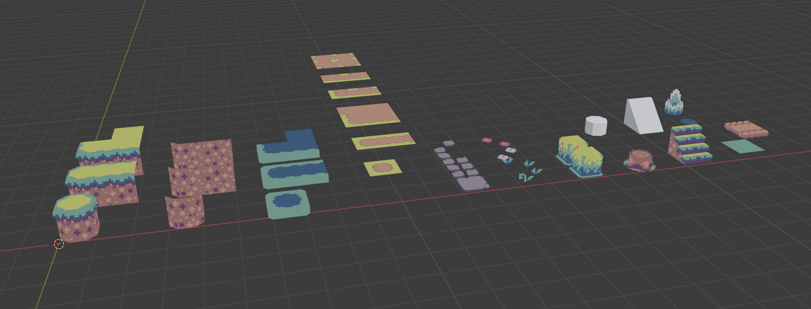

# Tiles

## Creating Tile Meshes

For this section I assume you are somewhat familiar with 3D modelling tools and importing assets into Unity.  

- Tiles should match the grid size within the tilemap (1x1x1unit tile should also have those bounds for the mesh)

- Pivots are always in the center of the gridsize. A 1m tile would have it's pivot at 0.5m. Tiles can go outside of their bounds in which case the pivot should be the center of the lowest tile element.

- The recommended orientation for the tiles should be how a corner would match a transform gizmo (borders on X and Z and Y up).

- Make sure meshes are imported with their Y axis facing up and Z axis forward since the tool will not fix your rotation for you.

!!! Info
    Skeletal or shapekey animations are not supported! They would be very expensive in a combined mesh.
    Please consider animations via gameobjects or a shader using either an uv offset loop or vertex color offsets.

## Adding Tiles
Right click in your project browser and choose **[MapTool > TileType]**.  

| Type   | Usage                                                            |
|--------|:-----------------------------------------------------------------|
| Single | Basic tile                                                       |
| Multi  | Supports variations for a clean grouping of tiles in the browser |
| Auto   | Sub tiles that get choosen depending on their neighbours         |

## General tile settings

Each tile has a number of default settings that need to be configured.  
Materials are shared by all the sub variations of a tile.  
The same goes for collision layer and the NavMesh specific Navigation Area.  
 
Next up we have the Tile Information.  
On a single tile you have one while on multi and auto tiles you have a list of them (auto tile has an additional mask per tile).

!!! Info
    The preview at the bottom of the inspector always shows the currently selected tile variation. You can use the small gizmo in it's corner to rotate it or left click the gizmo to choose from a selection of pre set orientations. The orientation of the preview will also be used for the tile icon in the tile explorer.

## Collider types
| Type         | Usage                                                                                      |
|--------------|:-------------------------------------------------------------------------------------------|
| None         | No collision                                                                               |
| Box          | Full tile collision. Should be choosen most of the time for optimal collider performance   |
| Box extend   | Full tile collision that extends upwards until it hits another tile                        |
| Mesh bounds  | Generates a box using Mesh.bounds as  it's size. Optimal for objects that are mostly cubic |
| Mesh convex  | Uses collision mesh but ticks the convex option to make it more performant                 |
| Mesh complex | Worst option but sometimes needed. Uses the collision mesh as it is                        |

## Auto Tiles and Tile masks

- Auto tiles supports both 4bit masks or 8bit masks (with corners) settable by a dropdown above the tile list.

- The Tile mask also includes a dropdown for tilemask rotations to reuse the same mesh over multiple directions.

- The more unique variations are required (corners / patterns) the more sub tiles you will need to configure (Worst case is 53 variations for no rotation 8bit mask).

- Sub variations within auto tiling are not supported due to the complexity. They can still be added via merge flags though.

| Type    | Usage                                |
|---------|:-------------------------------------|
| Single  | No rotation masks                    |
| Rotated | Masks for 90° / 180° / 270° rotation |
| Flip    | Mask for 180° rotation               |

!!! Warning
    When setting up a 4bit mask do not tick the diagonals. If you set up an 8 bit mask do not tick diagonals without ticked neighbours. These variations would always be optional and therefore are excluded from the algorithm. As the mask itself is used to pick the tile (for quicker lookup) they would never be choosen.

## Auto tile settings

- Border behaviour (how does a tile behave at the edge of a map)

- Orientation (only swap if tiles are intended to be used for a sideway 2.5d map)

- Merge flag behaviour (can be used to overwrite the flag rules for only this tile for "inner" auto tiles that are used on the inside of others)

## Optimization tips

- Use a texture atlas for your tiles instead of giving all of them their own texture / material. Tiles that share the same material can be combined into a single submesh. If you still need a custom material for a specific tile (example: transparent water) it will become it's own sub mesh later on.

- Try to stay relativly low poly. The algorithm won't merge tiles at their border points (and can't anyways due to their differences in uv coordinates). This means vertex count optimizations have to happen within the tiles mesh.

- If all of your tiles don't need normals / tangents / colors cosider turning them off in the mesh module.

- Consider using inbetween layer variations for muti high tiles that don't include the top part to reduce the total vertex count. Autotiles can be merged via flag so you can still have them on the same layer.

- If you have slopes or other geometry that would require mesh colliders consider preparing one in blender by hand. That way you can exactly control how many faces the end product has.

- Consider adding overlay type of tiles (like paths) as zero collision tiles on the layer above the floor. That way they can also overlay borders and corners which would otherwise interfere.
